# 🚀 Evora - Event Management System

## 📌 Overview
Evora is a powerful and intuitive application designed to streamline event management, team coordination, and certificate generation, making the process seamless and efficient.

## 📥 Download & Screenshots
Download the our latest project fully deployed and functional on your Android or IOS phones .
[📎 Download APK ](https://drive.google.com/drive/folders/1429qDuWnM35vW1WYXcEjmCug_uV7IwYW)

## 🎯 Features
### 🔍 Explore Events
- Discover and register for various events:
  - Hackathons 🏆
  - Workshops 📚
  - Ideathons 💡
  - Webinars 🎤
  - Coding Contests 💻
- Filter events by category.
- Event cards display:
  - Name 📝
  - Date & Duration 📅
  - Prize Pool 🎁 (if applicable)
- Click for detailed event info & registration.

### 🛠️ Add Event
Create new events with:
- Name 🏷️
- Description 📝
- Duration ⏳
- Event Date 📅
- Event Type 🔖 (Hackathon, Webinar, etc.)
- Prize Details 🎖️
- Team Size 👥
- Internship Availability 🎓
- Upload Image 📸

### 🏅 Team Registration
Participants provide:
- Name 🏷️
- Email 📧
- Age 🎂
- Password 🔐
- Team Name 👥
- College Name 🏫

### 📊 Profile
User profile includes:
- Leaderboard Rankings 🏆
- Event Participation Stats 📈
- Upcoming Features:
  - Number of Events Organized 📊
  - Upcoming & Past Events 📆
  - Total Participants 👥
  - Event Creation Stats 🏗️

### 🤖 Chatbot
- AI-powered chatbot for user queries.

### 🔎 Search
- Search for teams by College Name or Team Name.
- Streamlined navigation.

### 🎓 Certificate Generation
- One-click certificate generation 🖨️
- Instant download for storage 📂

## 🛠️ Tech Stack
- **Frontend:** Dart with Flutter 🎨
- **Backend:**
  - Node.js with MongoDB 🌐 (Handles Team Registration)
  - Spring Boot with SQL 🏛️ (Handles Event Creation)

## 🔗 API & Deployment
- **Backend API:** [Evora API](https://powerful-art-production.up.railway.app/events)
- **Team Registration API:** [Evora Users API](https://evora-production.up.railway.app/api/users)

## 🖼️ Images Section
_Insert screenshots or relevant images here._

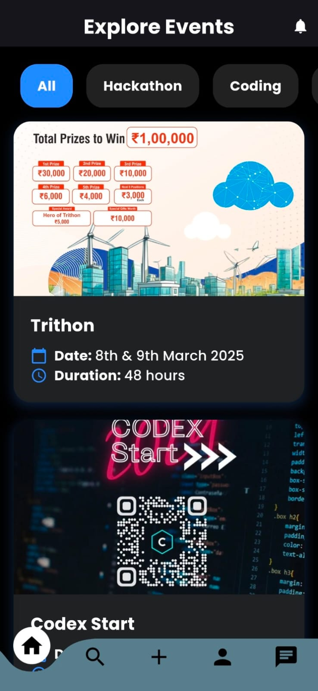
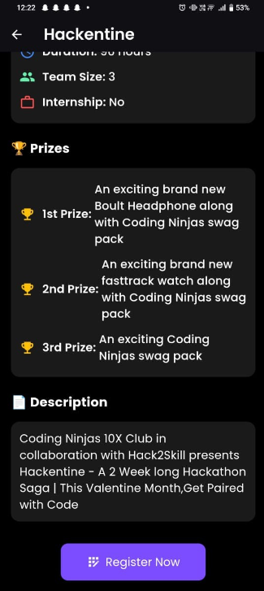
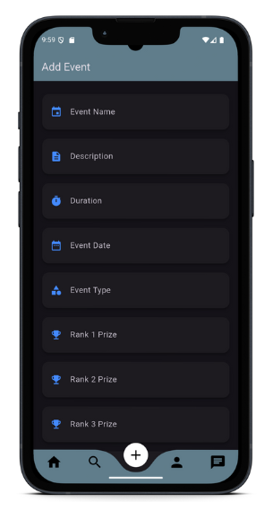
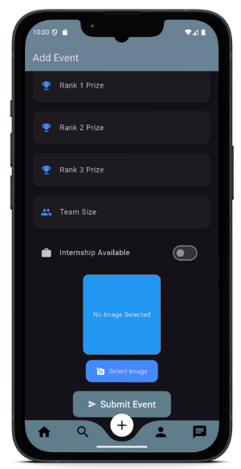
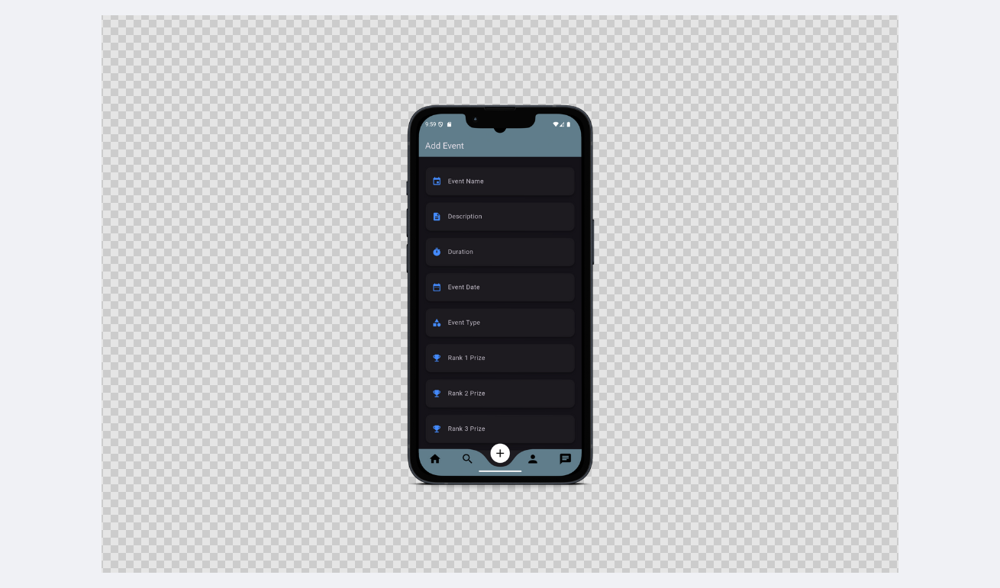
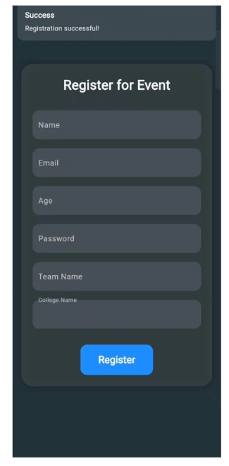

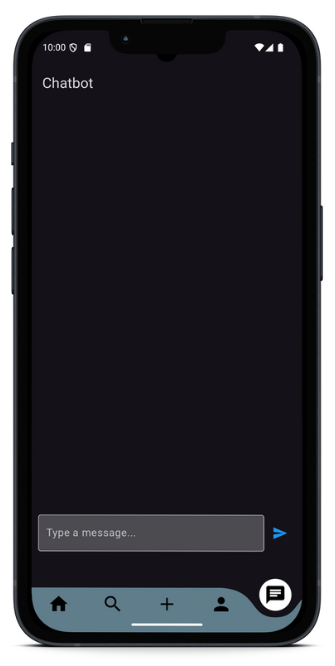
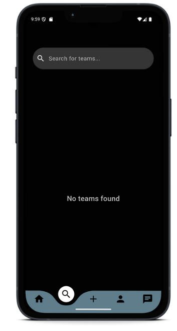
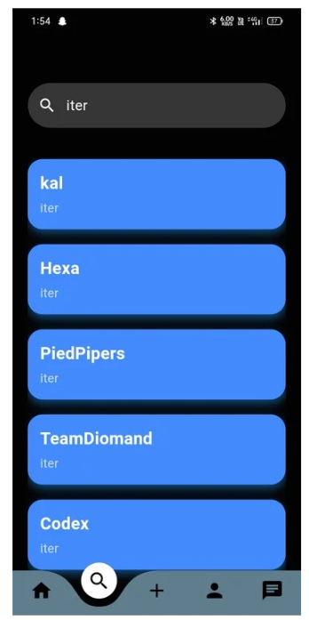
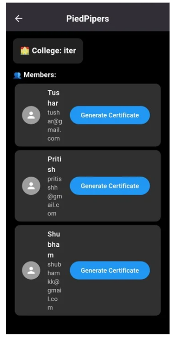
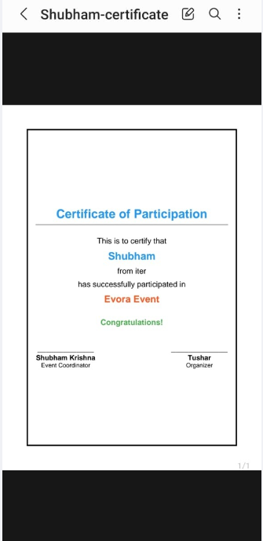

## ⚙️ How It Works
1. Fetch event data via API 🔄
2. Filter & view event details 🎯
3. Secure registration & team formation 🔐
4. Real-time event notifications 📢
5. Automatic certificate generation 🖨️

---

### 🤝 Contributions
We welcome contributions! Submit a pull request to improve the project.

### 📝 License
This project is licensed under the MIT License.
