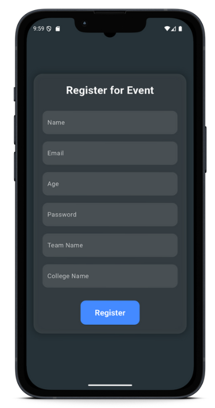

# Evora - Event Management System

## Overview
Evora is a powerful and intuitive application designed to streamline event management, team coordination, and certificate generation, making the process seamless and efficient.

## Features
### Explore Events Section
- Discover and register for various events, including:
  - Hackathons
  - Workshops
  - Ideathons
  - Webinars
  - Coding Contests
- Filter events based on categories like "Hackathon" or "Coding".
- Event cards display key details:
  - Event Name
  - Date & Duration
  - Prize Pool (if applicable)
- Click on an event for full details and registration.

### Add Event Section
Create new events by filling out details like:
- Event Name
- Description
- Duration
- Event Date
- Event Type (Hackathon, Webinar, etc.)
- Prize Details
- Team Size
- Internship Availability
- Upload Image

### Team Registration Section
Participants register by providing:
- Name
- Email
- Age
- Password
- Team Name
- College Name

### Profile Section
- User profile with leaderboard and event stats.
- Features under development:
  - Number of Events Organized
  - Upcoming & Past Events Hosted
  - Total Participants Across Events
  - Event Creation Stats

### Chatbot Section
- Integrated AI-powered chatbot for user queries.

### Search Section
- Find teams by College Name or Team Name.
- Organized, fast, and efficient navigation.

### Certificate Generation
- One-click automatic certificate generation.
- Download and store certificates easily.

## Tech Stack
- **Frontend:** Dart with Flutter
- **Backend:**
  - Node.js with MongoDB (Handles Team Registration)
  - Spring Boot with SQL (Handles Event Creation)

## API & Deployment
- **Backend API:** [Evora API](https://powerful-art-production.up.railway.app/events)
- **Team Registration API:** [Evora Users API](https://evora-production.up.railway.app/api/users)

## Downloads & Screenshots
- Download APK & View Screenshots: [Google Drive Link](https://drive.google.com/drive/folders/1m2hXJb5Jzd3-cUC-HBO5paB4kGhm3X5i?usp=sharing)

## Images Section
_You can insert screenshots or relevant images here._

## How It Works
1. The app fetches event data via API calls.
2. Users filter events and view detailed information.
3. Registration and team formation are handled securely.
4. Real-time notifications for event updates.
5. Automatic certificate generation for participants.

---

### Contributions
Feel free to contribute to the project by submitting pull requests!

### License
This project is licensed under the MIT License.
